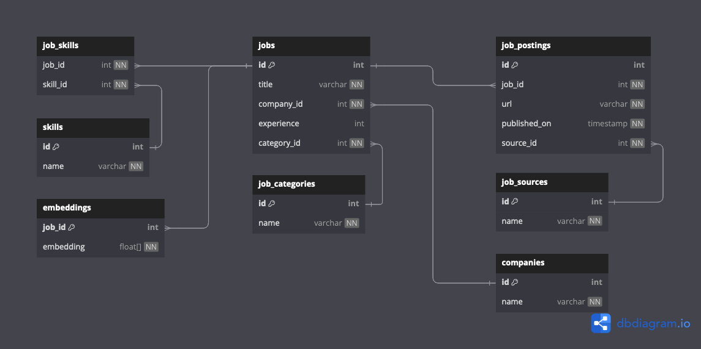

# it-jobs-analytics

## Analysis of technical vacancies on the Ukrainian IT market

Work in progress

- [x] Data Extraction (Beautiful Soup, html2text)
- [x] Data Lake (GCP Cloud Storage, Apache Parquet)
- [x] Data Pipeline Orchestration (Mage)
- [ ] Vector Embeddings for job descriptions (LangChain, OpenAI)
- [ ] Vector Database (PostgreSQL, pgvector)
- [ ] Extracting skills from the job description (GPT-3.5 Turbo)
- [ ] IaC (Terraform)
- [ ] Deployment (GCP)
- [ ] ...

Database Schema:

